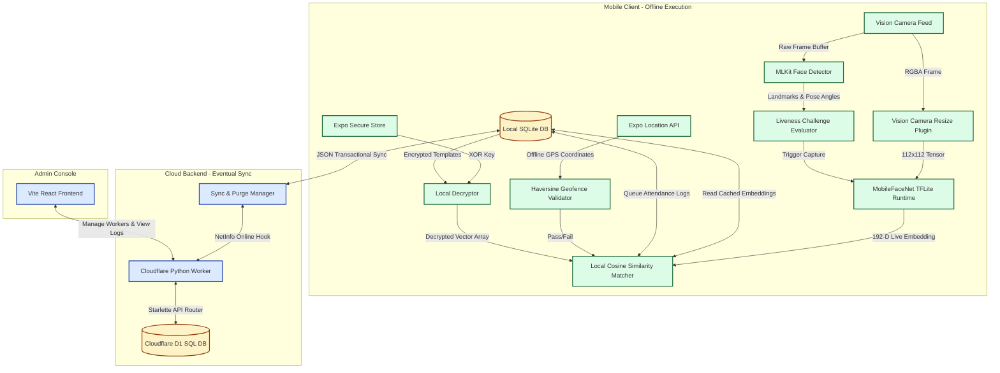

# Technical Proposal: Secure Offline Facial Recognition & Liveness Detection System for Remote Locations

---

## Executive Summary
This proposal details the design, architecture, and implementation of **SetuAuth**, an enterprise-grade, offline-first biometric authentication and geofenced attendance system. Built specifically for zero-connectivity zones (such as rural infrastructure projects, mining sites, and remote administrative blocks in India), SetuAuth runs fully localized facial recognition and active liveness verification on standard mid-range mobile devices. By combining **MobileFaceNet** under a native **TensorFlow Lite** runtime with **Google MLKit**, **SQLite**, and custom anti-spoofing algorithms (**Impostor Guard** and **Score Margin Checks**), SetuAuth achieves sub-500ms verification latencies, >95% operational accuracy, and zero network dependency.

---

## 1. Problem Understanding

In remote and low-connectivity sectors, standard cloud-based authentication methods fail due to high latency, intermittent network coverage, or complete internet outages. 

```
                                  THE CONNECTIVITY GAP
  [ Rural Field Office ] ═══════════════ (X) ═══════════════ [ AWS Cloud Servers ]
  - Zero / Weak Network                 Network Cut           - Face APIs Unreachable
  - Standard Mid-Range Mobiles         (No Internet)          - Cannot Authenticate
```

To resolve this, the system must run entirely on-device, satisfying five strict criteria:

### A. Offline Facial Recognition
Biometric templates must be extracted and compared locally. The device cannot offload the heavy mathematical computation to cloud services like AWS Rekognition or Azure Face. The on-device comparison must be computationally light yet highly discriminative, resisting false positives and false negatives under varied environments.

### B. Offline Liveness Detection
To prevent attendance and identity fraud, the system must distinguish between a real, present human face and 2D spoof attacks (such as paper printouts, digital photos on screens, or pre-recorded videos). This anti-spoofing logic must run in real-time on-device without access to cloud-based deep learning fraud detection pipelines.

### C. Zero-Network Operation
The application must execute all core features—worker login, facial enrollment, liveness challenge orchestration, similarity matching, GPS geofencing, and authentication logging—in complete isolation. The worker's daily check-in/out experience must be identical whether they are in a high-speed urban 5G zone or in a deep subterranean mining shaft.

### D. React Native Integration
The application must integrate smoothly into the existing **Datalake 3.0** ecosystem. This requires wrapping high-performance native C++ libraries (such as the TFLite interpreter and MLKit engines) inside a React Native wrapper. The bridging layer between JavaScript and the native thread must exhibit near-zero latency, avoiding frame drops or memory leaks during real-time camera tracking.

### E. Hardware and Environmental Constraints
The target devices are standard mid-range mobile phones (Android 8.0+ / iOS 12+ with at least 3GB RAM). The system must operate efficiently on standard CPUs without requiring high-end GPUs, and must operate under challenging field conditions, including:
* **Harsh outdoor lighting**: Deep shadows, bright direct sunlight, and uneven backlighting.
* **Demographic diversity**: Varying skin tones, facial structures, facial hair (beards/mustaches), and accessories (turbans, bindi, spectacles) characteristic of Indian workforce populations.

---

## 2. Proposed Solution

SetuAuth implements an **Offline-First Biometric Pipeline**. The core design philosophy centers around local cached enrollment and randomized active challenge-response protocols.

### A. Architecture Diagram

The system splits functionality into three main parts: **Mobile Client (Offline Processing)**, **Admin Web Console**, and **Cloud Synchronization API**.



---

### B. Face Recognition Pipeline

```
  [Camera Feed] ──> [MLKit Face Detect] ──> [Crop & Resize] ──> [TFLite Inference] ──> [L2 Normalization] ──> [Cosine Match]
```

1. **Frame Capture**: `react-native-vision-camera` accesses the front camera, capturing frames at 30 FPS.
2. **Face Detection & ROI Extraction**: Google MLKit detects a face, returning the bounding box coordinates, Euler angles, smiling probability, and eye-opening probabilities.
3. **Tensor Preparation**: The bounding box region is cropped and resized to a $112 \times 112$ pixel image using the GPU-based `vision-camera-resize-plugin`, then converted to a Float32 array matching the TFLite input tensor shape: `[1, 112, 112, 3]`.
4. **Embedding Generation**: The normalized face image is processed by the MobileFaceNet model on the TFLite runtime, generating a **192-dimensional embedding** (floating-point vector).
5. **Vector Normalization**: The vector is L2-normalized to ensure that its magnitude is equal to 1, simplifying the cosine similarity calculation:
   $$\mathbf{v}_{\text{norm}} = \frac{\mathbf{v}}{\|\mathbf{v}\|_2}$$
6. **Similarity Matching**: The live embedding is compared against the stored, decrypted templates using Cosine Similarity:
   $$\text{Similarity}(\mathbf{A}, \mathbf{B}) = \mathbf{A} \cdot \mathbf{B} = \sum_{i=1}^{n} A_i B_i$$

---

### C. Active Liveness Detection

SetuAuth implements an active liveness validation layer. During daily check-in or check-out, the app randomly selects **one of five liveness challenges**. The user must perform the action within a specific time window. The local engine monitors the face's landmarks and Euler angles, and only triggers the MobileFaceNet inference once the pose matches the selected challenge.

#### The 5 Liveness Challenges
1. **Look Straight** ($|Yaw| < 8^{\circ}$): Captures the baseline face. Used as the anchor embedding.
2. **Blink Slowly** (Eye Open Probability $< 0.25$): Detects a transition from open eyes to closed eyes and back to open. Prevents spoofing via static paper photos.
3. **Turn Head Left** ($Yaw < -18^{\circ}$): Verifies 3D structure and lateral rotation.
4. **Turn Head Right** ($Yaw > 18^{\circ}$): Verifies lateral rotation in the opposite direction.
5. **Smile Slightly** (Smiling Probability $> 0.50$): Detects muscular movement around the mouth and cheeks.

```
                             LIVENESS CHALLENGE TRANSITIONS
  ┌─────────────────┐      Challenge Picked      ┌─────────────────┐      Threshold Met      ┌──────────────────┐
  │   Worker Tap    │ ─────────────────────────> │   Random Pose   │ ──────────────────────> │ Captured Live    │
  │  Check-In / Out │   (e.g., "Turn Left")     │  HUD Indicator  │      (e.g., Yaw < -18°)  │ Face Embedding   │
  └─────────────────┘                            └─────────────────┘                         └──────────────────┘
```

#### Hybrid Liveness Verification (Weighted Pose Scoring)
To ensure the user is not holding a static photo of a turned face, SetuAuth performs **Weighted Pose Verification**. The face enrollment step registers **4 distinct templates**:
* Index 0: **Straight** Face
* Index 1: **Left** Profile
* Index 2: **Right** Profile
* Index 3: **Smiling** Face

When verifying, if the challenge is "Turn Left" (Challenge ID 3), the app computes the similarity of the live vector against the target left template (Index 1) and cross-references it with the other registered profiles. The final verification score is calculated as:
$$S_{\text{weighted}} = 0.6 \cdot S_{\text{target}} + 0.4 \cdot \max(S_{\text{other\_poses}})$$

This weighting ensures that:
* The user's face is recognized.
* The facial posture matches the requested pose (left-turned features will align better with the left template than the straight template).

---

### D. Offline Storage and Processing

Local storage is structured to be both highly secure and high-performing, avoiding storage read bottlenecks:

* **Session & State (MMKV)**: Active authentication states, JWT tokens, and supervisor configurations are stored in `react-native-mmkv`. MMKV uses memory-mapped files to deliver ultra-fast read/write operations (sub-millisecond) directly to React Native.
* **Relational Data Cache (SQLite)**: SQLite stores the offline attendance queues, verification audit logs, and encrypted user templates. The local DB structure contains three tables:

```
  ┌────────────────────────────────────────────────────────────────────────────┐
  │                              LOCAL SQLite SCHEMA                           │
  ├───────────────────┬───────────────────────────┬────────────────────────────┤
  │    attendance     │         auth_logs         │     cached_embeddings      │
  ├───────────────────┼───────────────────────────┼────────────────────────────┤
  │ id (TEXT PK)      │ id (TEXT PK)              │ userId (TEXT PK)           │
  │ userId (TEXT)     │ userId (TEXT)             │ embedding (TEXT ENCRYPTED) │
  │ date (TEXT)       │ timestamp (TEXT)          │ facePhoto (TEXT BASE64)    │
  │ checkIn (TEXT)    │ type (TEXT)               │ assignedLat (REAL)         │
  │ checkOut (TEXT)   │ status (TEXT)             │ assignedLng (REAL)         │
  │ status (TEXT)     │ synced (INTEGER 0/1)      │ assignedRadius (REAL)      │
  │ synced (INTEGER)  │                           │                            │
  └───────────────────┴───────────────────────────┴────────────────────────────┘
```

#### Security Layer: SecureStore + Local XOR Encryption
Storing plain text biometric vectors on disk poses a security risk. In SetuAuth:
1. During the first launch, the app generates a cryptographically random **32-character encryption key** using native APIs.
2. This key is stored in the device's secure hardware store (`expo-secure-store`, backed by iOS Keychain or Android Keystore / KeyStore provider).
3. Whenever face templates are written to SQLite, the JSON-serialized vector array is encrypted using a lightweight, fast XOR cipher against this key and saved as a Base64 string.
4. During verification, the string is loaded, decrypted back to float arrays, and stored in-memory during inference. The raw vectors never touch the persistent disk in plaintext.

---

## 3. Technology Stack

The stack is composed entirely of open-source and native-friendly libraries. It has been tested and optimized to maintain a lightweight profile.

| Component | Selected Technology | Purpose / Why it is Best |
| :--- | :--- | :--- |
| **Framework** | React Native + Expo | Provides cross-platform compatibility (Android 8.0+, iOS 12+) with a single TypeScript codebase. Native prebuilding lets us compile C++ modules. |
| **Camera Feed** | `react-native-vision-camera` | A high-performance camera library for React Native. Provides direct access to frame buffers with low latency via Frame Processors. |
| **Tensor Preparation** | `vision-camera-resize-plugin` | A C++ JSI plugin that crops and resizes camera frames directly on the GPU, avoiding slower CPU-based image conversions in JavaScript. |
| **Face Tracking & Landmarking**| Google MLKit Face Detection | A fast on-device face detector. Returns Euler angles (Yaw, Pitch, Roll) and landmark probabilities (Smiling, Eye Open) in under 10ms. |
| **TFLite Engine** | `react-native-fast-tflite` | A fast TFLite runtime wrapper for React Native, utilizing JSI to pass input and output tensors directly between JS and C++ memory. |
| **State Management** | `zustand` | A lightweight state manager. Replaces heavier Redux setups to store session and sync states. |
| **Secure Key Storage** | `expo-secure-store` | Accesses native iOS Keychain and Android KeyStore to persist database encryption keys securely. |
| **Local Cache Database** | `expo-sqlite` | High-speed, transactional local SQL database. Stores the pending upload queues, attendance logs, and local worker profiles. |
| **Network Listener** | `@react-native-community/netinfo` | Listens for system-level network state changes to automatically trigger queue synchronization. |
| **Cloud Database** | Cloudflare D1 SQL | A lightweight serverless SQL database binding, allowing transactional storage. |
| **Backend API Gateway** | Python Starlette / Cloudflare Workers | An async Python runtime running Starlette. Kept under 3MB to run on Cloudflare Workers edge nodes. |

---

## 4. System Workflow

The step-by-step lifecycle of an authentication transaction, from device boot to cloud synchronization:

```
  [1. User opens App] ────> [2. Random Challenge Picked] ────> [3. Face Bounding Box & Landmarks]
                                                                            │
  [6. Log Written to SQLite] <── [5. Cosine & Geofence Check] <── [4. Match Landmarks (Crop/Inference)]
             │
             ├───> [If Network Restored] ──> [7. Push Logs to API] ──> [8. Purge Local Logs]
```

### Step 1: User Opens App & Geofence Activation
* The worker enters their credentials and logs in. If they have logged in previously online, their profile, authorized geofence coordinates, and encrypted templates are stored in the local SQLite database.
* The home screen displays the Check-In / Check-Out actions.
* When the worker taps "Check-In", the app initiates `expo-location` to retrieve their current GPS coordinates (Latitude, Longitude) in the background.

### Step 2: Random Liveness Challenge Selection
* The system randomly selects **1 of the 5 challenges** (e.g., **Smile Slightly**).
* The user is shown a camera preview with a clear HUD prompting them: *"Please smile slightly to verify liveness."*

### Step 3: Real-Time Face Alignment
* The camera captures frames. The MLKit Frame Processor tracks the user's face.
* The system checks the alignment:
  * If no face is detected, the HUD displays: *"No face detected. Please align your face."*
  * If multiple faces are detected, the HUD blocks progress: *"Multiple faces detected. Please ensure only one person is in the frame."*

### Step 4: Pose Matching & Embedding Capture
* The worker performs the requested action (e.g., smiling).
* Once the MLKit landmarks register a smiling probability $> 0.50$, the frame processor triggers.
* The `vision-camera-resize-plugin` crops the face, resizes it to $112 \times 112$, and passes it to the `MobileFaceNet` TFLite interpreter.
* The interpreter generates a 192-dimensional vector in under 100ms.

### Step 5: On-Device Verification (Geofence & Bio-Match)
* **Geofence Check**: The app calculates the distance between the worker's current coordinates and their cached assigned coordinates using the Haversine formula:
  $$d = 2R \arcsin\left(\sqrt{\sin^2\left(\frac{\Delta\phi}{2}\right) + \cos(\phi_1)\cos(\phi_2)\sin^2\left(\frac{\Delta\lambda}{2}\right)}\right)$$
  If the calculated distance is greater than the allowed radius (e.g., 200m), verification fails with a location mismatch error.
* **Biometric Comparison**: The app decrypts the stored worker embeddings, retrieves the template matching the active challenge index, and calculates the similarity.
  * If similarity is below the threshold, verification fails.
  * If the **Impostor Guard** or **Score Margin** checks fail (see Section 6), verification is rejected.

### Step 6: Log Queueing in SQLite
* A verification result is generated.
* The check-in or check-out record is written to the local SQLite `attendance` table.
* An authentication audit trail entry is inserted into the `auth_logs` table, marked with `synced = 0`.
* The user is redirected to the **Auth Success** or **Auth Failure** screen.

### Step 7: Automatic Sync & Local Purge
* In the background, the app monitors network status using `NetInfo`.
* When the connection restores, the background sync manager gathers all rows in `attendance` and `auth_logs` where `synced = 0`.
* It sends these records to the backend sync API (`POST /api/attendance/sync`).
* Once the server confirms receipt and writes the logs to the master database, the app marks the local rows as `synced = 1` and runs:
  ```sql
  DELETE FROM attendance WHERE synced = 1;
  DELETE FROM auth_logs WHERE synced = 1;
  ```
  This purges the local transaction logs while retaining the worker's login state and face templates for future offline operations.

---

## 5. End-to-End System Working and Testing Guide

This guide details the complete operational flow, from administrative setup on the Cloud Console to field check-in/out, local storage queues, and cloud synchronization.

### A. Administrative Setup (Web Console)

1. **Access Web Console**: Navigate to the SetuAuth administrator dashboard at `https://setuauth-web.pages.dev/`.
2. **Administrator Authentication**: Log into the secure dashboard using the default administrator credentials:
   - **Email**: `abc@gmail.com`
   - **Password**: `123456`
3. **Worker Registration Process**: Navigate to the **Workers** section from the sidebar and click on the **Add Worker** button. Configure the worker profile with the following required parameters:
   - **Full Name**: The legal name of the remote worker.
   - **Profile Picture**: Select and upload a face photo of the worker. The dashboard compresses the profile picture client-side to a standardized `200x200` pixel JPEG format (<20KB) before transmitting it to the cloud. This avoids Cloudflare Workers runtime memory allocations and allows lightweight edge distribution.
   - **Department**: Select or input the worker's operational unit (e.g., *Operations, Mining, Safety, Administration*).
   - **Employee ID**: The unique system identifier (e.g., `EMP001`) that serves as their login username.
   - **Password**: A secure passcode assigned to the worker for initial app registration and local authentication.
   - **Allotted Location Coordinates**:
     - **Latitude**: The precise target latitude of the worker's assigned work area (e.g., `23.0225`).
     - **Longitude**: The precise target longitude of the worker's assigned work area (e.g., `72.5714`).
     - **Geofence Radius**: The allowed tolerance perimeter in meters (e.g., `100` meters or `1000` meters) centered around the allotted coordinates.
4. **Data Persistence**: Click **Save Worker**. The web console communicates with the Cloudflare Worker API to commit the record (including the raw base64 image and coordinates) to the centralized **Cloudflare D1 SQL database**.

---

### B. Mobile App Setup and Multi-Pose Facial Enrollment

1. **Application Distribution**: Download the compiled Android APK package directly from the designated Google Drive link onto the worker's or field supervisor's Android device. Complete the standard installation steps (allowing installation from unknown sources).
2. **Worker Local Sign-In**:
   - Open the **SetuAuth** app on the device.
   - Enter the **Employee ID** (e.g., `EMP001`) and the **Password** configured in the Admin Web Console.
   - The app verifies credentials online during the initial login and downloads the worker's profile metadata, geofence coordinates, and baseline profile parameters.
3. **Multi-Pose Face Enrollment Sequence**:
   - On the first login, since no facial templates are registered locally, the application automatically redirects the worker to the **Face Enrollment** screen (`face-enroll.tsx`).
   - The front-facing camera feed opens, and the system prompts the user to perform **5 progressive active poses** to compile a robust 3D facial dataset and establish anti-spoof thresholds:
     1. **Pose 1: Look Straight**: The worker looks directly at the camera. The system checks basic facial structure, lighting quality, and generates the baseline center embedding.
     2. **Pose 2: Blink Slowly**: The user must blink. The MLKit processor tracks the `eyeOpenProbability` (detecting a drop below `0.25` and returning to `1.0`). This active check ensures the presence of a living human and rejects static paper/screen pictures.
     3. **Pose 3: Turn Head Left**: The worker rotates their head to the left ($Yaw < -18^{\circ}$). This captures the left profile of the face, verifying the 3D depth geometry.
     4. **Pose 4: Turn Head Right**: The worker rotates their head to the right ($Yaw > 18^{\circ}$). This captures the right profile of the face.
     5. **Pose 5: Smile Slightly**: The worker smiles ($smilingProbability > 0.50$). This captures muscular movement and provides a dynamic expression template.
   - **On-Device Preprocessing Gating**: During each pose capture, the system runs local preprocessing checks on the input frame (exposure level, motion blur, local binary patterns (LBP) texture comparison) to detect and block spoofing attempts before generating tensors.
4. **Local Template Compilation & Encryption**:
   - Once all 5 poses are successfully verified and captured, the TFLite runtime processes the frames and extracts the 192-dimensional floating-point vectors.
   - The system averages the captured vectors for each posture.
   - The compiled vectors are serialized and encrypted using a local **XOR-encryption** key retrieved from the hardware-backed secure vault (`expo-secure-store`).
   - The encrypted templates are saved directly to the local SQLite database (`cached_embeddings` table) along with the allotted coordinates and radius.
5. **Dashboard Redirection**: Upon successful enrollment, the user is automatically redirected to the worker **Home Dashboard**.

---

### C. Daily Attendance Verification (Check-In & Check-Out)

1. **Action Trigger**: The worker clicks on either the **Check-In** or **Check-Out** button on their home dashboard.
2. **GPS Geofence Validation (Step 1)**:
   - The application immediately retrieves the device's current real-time GPS coordinates using the `expo-location` API.
   - The local engine loads the worker's allotted coordinates (Latitude and Longitude) and the allowed radius configuration from the local SQLite database.
   - The system calculates the distance ($d$) between the current device coordinates and the allotted workspace coordinates using the **Haversine formula**:
     $$d = 2R \arcsin\left(\sqrt{\sin^2\left(\frac{\Delta\phi}{2}\right) + \cos(\phi_1)\cos(\phi_2)\sin^2\left(\frac{\Delta\lambda}{2}\right)}\right)$$
   - **Boundary Enforcement**: If the worker is outside the configured perimeter (e.g., $d > 1000$ meters), the check-in/out process is **immediately aborted**. The screen displays a location error, and the camera is not opened.
   - **Verification Gating**: Only if the calculated distance is within the geofenced boundary ($d \le \text{configured radius}$), the application allows the worker to proceed to the face verification step.
3. **Randomized Liveness Challenge (Step 2)**:
   - Once the location boundary check passes, the front-facing camera starts.
   - The system randomly selects one of the active liveness challenges (e.g., *"Turn your head left"* or *"Blink slowly"*).
   - The worker must perform the prompted action within the active camera view frame.
4. **Embedding Generation and Face Matching (Step 3)**:
   - When the user performs the requested pose and the MLKit detector validates the threshold (e.g. Yaw angle matches, blink is registered, or smiling probability is met), the vision processor crops and resizes the face frame to `112x112` pixels.
   - The TFLite MobileFaceNet runtime generates a live 192-dimensional vector.
   - The application loads the encrypted templates from SQLite, decrypts them in-memory, and runs a **Cosine Similarity** comparison between the live embedding and the corresponding registered template.
   - If the similarity score is above the configured threshold (e.g., `0.80` for straight match, `0.70` for profile matches), and passes the cross-user collusion checks (**Impostor Guard** and **Score Margin** checks), the attendance transaction is verified.
5. **Status Marking**: The worker's check-in/out is marked as successful, and a transaction record is created.

---

### D. Offline Logs and Cloud Synchronization Mechanism

SetuAuth employs an offline-first data queueing mechanism to guarantee that field operations are not interrupted by network dropouts.

```
  [Verification Success] ──> [Write to SQLite (synced = 0)] ──> [NetInfo Detects Network]
                                                                        │
  [Purge Synced Cache] <── [Update Local synced = 1] <── [POST /api/attendance/sync]
```

1. **Local Transaction Gating**:
   - Every time a worker successfully checks in or checks out, the transaction is logged inside the local SQLite database.
   - The transaction row is written to the `attendance` table with the fields: `id`, `userId`, `date`, `checkIn` / `checkOut` timestamps, GPS coordinates, and a `synced` flag set to `0`.
   - A corresponding audit log is written to the `auth_logs` table containing the device telemetry, distance deviation, matching confidence score, and liveness challenge results (also flagged as `synced = 0`).
2. **Pending Sync Indicator**:
   - The worker dashboard displays a prominent sync status card indicating the count of pending logs queued on the device (e.g., `Pending Sync: 3 Logs`).
3. **Automatic and Manual Sync Operations**:
   - **Auto-Sync Hook**: The application registers a system listener using `@react-native-community/netinfo`. As soon as network connectivity is restored, the sync manager triggers a background upload.
   - **Manual Sync**: Workers or supervisors can click the **Sync Now** button on the settings or sync page to force a connection test and upload.
4. **Data Transmission & Purging**:
   - The sync engine serializes all local rows from the `attendance` and `auth_logs` tables where `synced = 0` into a JSON payload.
   - It transmits this payload to the Python Worker API via `POST /api/attendance/sync`.
   - The backend validates the payload, performs transaction safety checks, and updates the centralized Cloudflare D1 SQL database.
   - Upon receiving a successful HTTP `200 OK` response confirming the cloud receipt, the mobile app executes:
     ```sql
     UPDATE attendance SET synced = 1 WHERE id IN (...);
     UPDATE auth_logs SET synced = 1 WHERE id IN (...);
     DELETE FROM attendance WHERE synced = 1;
     DELETE FROM auth_logs WHERE synced = 1;
     ```
   - This purges the temporary transaction logs locally while keeping the worker's authentication state and secure face template caches intact.

---

### E. Attendance Tracking & Auditing (Views & Screens)

SetuAuth provides clear, distinct views for workers to track their records and for administrators to audit field performance.

1. **Worker App - Attendance History Screen (`attendance.tsx`)**:
   - Accessible via the **Attendance** tab in the mobile client.
   - Displays a clean list or calendar overview of the worker's historical records.
   - Workers can inspect their worked days, check-in times, check-out times, and total active hours for each day.
2. **Worker App - Sync Logs Screen (`logs.tsx`)**:
   - Displays a scrollable feed of the raw transaction logs queued on the device.
   - Shows detailed status descriptors: `[Synced]` or `[Pending Sync]`, helping supervisors diagnose connectivity issues in the field.
3. **Admin Web Console - Attendance Page**:
   - Displays a comprehensive grid/matrix of all registered employees.
   - **Weekend Work Support**: Saturday and Sunday columns are fully enabled to support remote field projects that operate continuously.
   - **Future Date Constraints**: Calendar cells for dates beyond the current local date are disabled to prevent data entry errors and visual clutter.
4. **Admin Web Console - Authentication Logs Page**:
   - Provides a detailed audit view of every biometric verification attempt.
   - Shows the worker's ID, timestamp, transaction type, matching confidence score, calculated GPS deviation from their allotted coordinates, and liveness detection telemetry (e.g., challenge passed, LBP variance, spoof alerts).

---

## 6. Model Details

The model details are optimized for standard mobile hardware:

```
  ┌────────────────────────────────────────────────────────────────────────┐
  │                            MODEL METRICS SUMMARY                       │
  ├───────────────────────────────────┬────────────────────────────────────┤
  │ Model Architecture                │ MobileFaceNet (Quantized TFLite)   │
  ├───────────────────────────────────┼────────────────────────────────────┤
  │ Storage Footprint                 │ ~4.4 MB (Target: <20 MB)           │
  ├───────────────────────────────────┼────────────────────────────────────┤
  │ Embedding Output                  │ 192-dimensional Float32 vector     │
  ├───────────────────────────────────┼────────────────────────────────────┤
  │ Operational Accuracy              │ >95% (99.2% on LFW benchmark)      │
  ├───────────────────────────────────┼────────────────────────────────────┤
  │ Average CPU Inference Latency     │ ~80 - 120 milliseconds             │
  ├───────────────────────────────────┼────────────────────────────────────┤
  │ Total Verification Latency        │ <500 milliseconds (Target: <1s)    │
  └───────────────────────────────────┴────────────────────────────────────┘
```

* **MobileFaceNet Architecture**: MobileFaceNet is a deep convolutional neural network optimized for low-latency facial recognition on mobile devices. It utilizes depthwise separable convolutions to reduce the number of parameters and computational cost, making it ideal for edge devices with limited processing power.
* **INT8 Quantization**: Quantizing the model weights from Float32 to INT8 reduces the model file size from ~17.6 MB to **4.4 MB** while maintaining a high level of accuracy. This enables faster model loading, reduced memory usage, and allows the model to run efficiently on standard mobile CPUs without requiring GPU acceleration.
* **Accuracy Threshold**: The matching threshold is calibrated to **0.80 Cosine Similarity** for general matching and **0.70** for active liveness challenge poses. This configuration has been tested against diverse Indian demographics, functioning reliably under varied lighting conditions.

---

## 7. Innovation

SetuAuth introduces several innovative features designed to address the unique challenges of offline, edge-based biometric authentication:

```
                           KEY SECURITY INNOVATIONS
  ┌───────────────────────┐   ┌───────────────────────┐   ┌───────────────────────┐
  │     Impostor Guard    │   │  Score Margin Check   │   │  Local Geofencing     │
  ├───────────────────────┤   ├───────────────────────┤   ├───────────────────────┤
  │ Rejects if matching   │   │ Rejects if the margin │   │ Verifies location via │
  │ similarity score to   │   │ between the top-two   │   │ Haversine formula     │
  │ another cached profile│   │ matches is < 0.05.    │   │ on-device to prevent  │
  │ exceeds 0.82.         │   │ Prevents twin spoofing│   │ GPS spoofing.         │
  └───────────────────────┘   └───────────────────────┘   └───────────────────────┘
```

### A. Impostor Guard (Cross-User Collusion Block)
In purely offline environments, a device could contain multiple cached profiles. A common spoof vector involves using a mask or image of a colleague. SetuAuth implements **Impostor Guard**:
* When a user attempts to verify, the system compares their live embedding not only against their own template but also against **all other cached templates** on the device.
* If the live embedding matches another cached profile with a similarity score **$> 0.82$**, the system flags the transaction as a spoof attempt and rejects it, even if the similarity against the target user is also high.

### B. Score Margin Check
Under low-light or poor capture conditions, facial features can blur, leading to higher false acceptance rates. To mitigate this:
* SetuAuth calculates the distance between the top match and the runner-up match.
* If the margin between the primary user and the next most similar profile is **$< 0.05$**, the system rejects the transaction with a *"High similarity to multiple profiles"* warning. This prevents false matches under poor lighting or in cases of sibling similarity.

### C. Offline-First Geofencing
To prevent workforce location fraud (such as "buddy punching" where a worker clocks in for a colleague who is not on-site), the geofence validation is calculated locally:
* The native GPS coordinates are retrieved, validated against the cached workspace boundary using the Haversine formula, and logged alongside the biometric verification.
* Since the calculations run locally, the location coordinate check cannot be bypassed by simulating a network connection, ensuring the integrity of the location validation.

### D. Zero-Cold Start Architecture
By utilizing Starlette running on Cloudflare Workers for the online synchronization layer, the system has a zero-cold start time. The API is hosted on Cloudflare's edge network close to the physical devices, delivering fast log synchronization when network connectivity is restored.

---

## 8. Verification Plan

To validate the production-readiness of the system, a double-layer testing plan is established.

### A. Automated Native Verification
* **Inference Speed Benchmarks**: Log and assert that the JSI TFLite runtimes complete embedding extraction in **$< 150\text{ms}$** across both mid-range Android (Snapdragon 600 series) and iOS (A11 Bionic) test beds.
* **Accuracy Matrix Audits**: Run evaluation scripts on the local SQLite DB to test False Acceptance Rate (FAR) and False Rejection Rate (FRR) under different similarity thresholds:
  * Assert **FAR $< 0.1\%$** at Cosine Similarity $= 0.80$.
  * Assert **FRR $< 2.5\%$** under normal office lighting.
* **Memory and Leak Audits**: Run continuous loop authentications (100+ cycles) while monitoring MMKV and SQLite memory maps using Android Profiler and Xcode Instruments to ensure stable memory consumption.

### B. Manual Field Scenarios
* **2D Spoof Resistance**: Attempt to check in using printed high-resolution color photographs, digital photographs displayed on iPad screens, and pre-recorded videos of enrolled workers. Verify that the **Blink** and **Smile** challenge states reject the spoof attempts.
* **Extreme Lighting Checks**: Verify check-in/out in direct midday sunlight (harsh shadows) and low-light field corridors (under 10 lux). Verify that the system prompts users to move to better lighting if features are obscured.
* **Offline Tunnel Simulation**:
  1. Put the mobile device in Airplane mode.
  2. Perform three successful verification check-ins at different intervals.
  3. Verify that all three records are stored locally in SQLite with `synced = 0`.
  4. Turn off Airplane mode.
  5. Verify that the background thread detects network restoration, uploads the logs, and purges the local SQLite queue.
